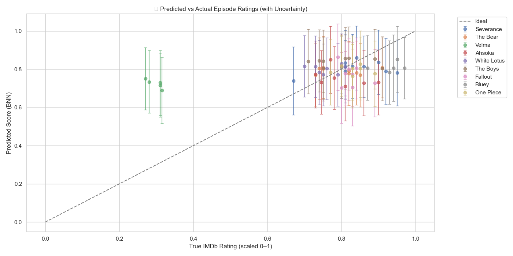

# 🎬 Predicting TV Episode Reception with Bayesian Neural Networks

---

# Executive Summary

## Purpose  
Streaming platforms, writers rooms, and marketing teams need reliable ways to anticipate how audiences will react to new episodes. Online discourse shifts rapidly, sentiment swings around key narrative moments, and traditional analytics often lack uncertainty estimates. This project builds a Bayesian Neural Network system that forecasts episode-level audience reception using Reddit discussions, topic modeling, and sentiment analysis.

## Action  
The project analyzes episode-specific Reddit threads, transforms comments into topic and sentiment vectors, and feeds those into a Bayesian Neural Network implemented in Pyro. The workflow includes preprocessing, LDA topic extraction, VADER sentiment scoring, feature assembly, BNN training, posterior predictive sampling, and visualization of predicted ratings with credible intervals.

## Conclusions  
The Bayesian model delivers calibrated and interpretable predictions for multiple shows including Severance, The Bear, Ahsoka, One Piece, and White Lotus. It accurately tracks episode-level dynamics and highlights cultural outliers such as Velma, where predicted reception differs sharply from IMDb labels. The model generalizes well even on unseen episodes, making it useful for forecasting audience reactions and identifying narrative risks.

## Evidence  
Repository contents:

    /data/                     → Reddit comment datasets and cleaned text  
    /Assets/Plots/             → Prediction plots and uncertainty visualizations  
    /lda_topics/               → Topic vectors for each episode  
    /src/                      → Preprocessing, model code, and utilities  
    /notebooks/                → End-to-end training, evaluation, and diagnostics  

---

## Overview
This project applies Bayesian Neural Networks combined with topic modeling and sentiment analysis to predict how audiences will receive streaming TV series. By analyzing fan discussions on Reddit, the model forecasts episode-level audience ratings with probabilistic confidence, providing actionable insights for content creators and marketers.

## Objectives
- Predict episode-level audience reception with quantified uncertainty  
- Enable strategic content and marketing decisions through early audience insight  

---

## Approach
The analysis uses a layered Bayesian pipeline:

- **Bayesian Neural Network (BNN)**  
  Predicts IMDb-style episode ratings using Pyro with uncertainty-aware inference

- **Latent Dirichlet Allocation (LDA)**  
  Extracts topics from Reddit discussions, identifying themes driving audience discourse

- **VADER Sentiment Analysis**  
  Captures emotional tone and sentiment shifts across episodes

Together these elements reveal both the predicted reception and the underlying narrative or thematic reasons for audience reactions.

---

## Key Findings
- The BNN reliably predicted episode ratings for shows including Severance, The Bear, and Ahsoka  
- Cultural outliers were clearly identified, such as Velma, where predicted ratings diverged from IMDb due to non-organic discourse patterns  
- The model generalized across unseen episodes and new shows, capturing reception patterns even with sparse or noisy input  

---

## Impact and Applications
- Supports writer and showrunner decisions by highlighting episode-level narrative risks  
- Helps marketing teams target messaging around sentiment drivers  
- Identifies controversial or weak-performing episodes early  
- Provides interpretable, uncertainty-aware insights rather than black-box predictions  

---

## Limitations and Future Directions
- Reddit-only data may overlook broader audience reactions  
- Incorporating YouTube, TikTok, and review platforms would broaden coverage  
- Future work includes hybrid models that combine LDA, LSTM, and Bayesian inference  

---

## 📚 Data Sources

| Feature Set         | Description                            |
|---------------------|----------------------------------------|
| Reddit comments     | Episode-specific threads from r/TV and related communities |
| LDA topics          | 10-dimensional vectors per episode     |
| VADER sentiment     | Average tone per episode               |
| IMDb labels         | Scaled soft labels for regression      |

---

## 🧠 Bayesian Neural Networks: A Brief Mathematical Primer

A Bayesian Neural Network learns distributions over weights instead of fixed values:

`p(w | D) ∝ p(D | w) ⋅ p(w)`

Where:
- `p(w)` is the prior  
- `p(D | w)` is the likelihood  
- `p(w | D)` is the posterior  

Variational inference approximates this posterior.  
The objective is the Evidence Lower Bound:

`ELBO = E_q(w)[log p(D | w)] - KL(q(w) || p(w))`

We use `AutoMultivariateNormal` to capture full posterior correlations.

---

## 🛠️ Model Pipeline

1. **Preprocessing**
   - Clean and tokenize Reddit comments  
   - Compute sentiment  
   - Generate LDA topic vectors  

2. **Model Inputs**
   - 11-dimensional vector per episode  
   - Ten LDA topic proportions plus sentiment score  

3. **BNN Training**
   - Bayesian regression with Normal likelihood  
   - ELBO optimization in Pyro  

4. **Posterior Inference**
   - Use `Predictive` with posterior sampling  
   - Compute posterior means and credible intervals  

---

## 📊 Results Overview

The model produced strong episode-level predictions with calibrated uncertainty.

### 🎯 Episode-Level Accuracy
- Predictions typically fall within one standard deviation of true IMDb ratings  
- Shows with consistent fandom behavior, such as The Bear and Severance, yielded high stability  
- Velma diverged significantly, indicating a mismatch between discourse and review behavior  

### 🧪 Generalization Test
Training on all but the final two episodes per show:

- One Piece and Fallout episodes predicted successfully despite low comment counts  
- Strong performance on Ahsoka, The Boys, Daredevil, Bluey  
- Velma remained an outlier  

---

## 📈 Visualization

Blue points represent predicted values.  
Vertical bars denote uncertainty.  
X marks show IMDb labels.

---

## ✅ Conclusion
Bayesian modeling provides transparency, calibrated uncertainty, and insight into narrative or discourse-driven outliers. The BNN successfully predicts audience reception across genres and platforms, identifying both high-performing episodes and culturally unusual cases. This work contributes a scalable approach for understanding viewer response before, during, and after release cycles.

---

## 🔄 Future Work

| Enhancement                     | Purpose                               |
|--------------------------------|----------------------------------------|
| Add YouTube comments           | Improve robustness for polarizing shows |
| Add time-series structure      | Capture progression across episode drops |
| Compare with deterministic NNs | Understand value of Bayesian uncertainty |
| Explore LDA+LSTM hybrids       | Capture narrative arcs more explicitly |

---

## 🧾 References

- IMDb  
- Pyro  
- Reddit  

